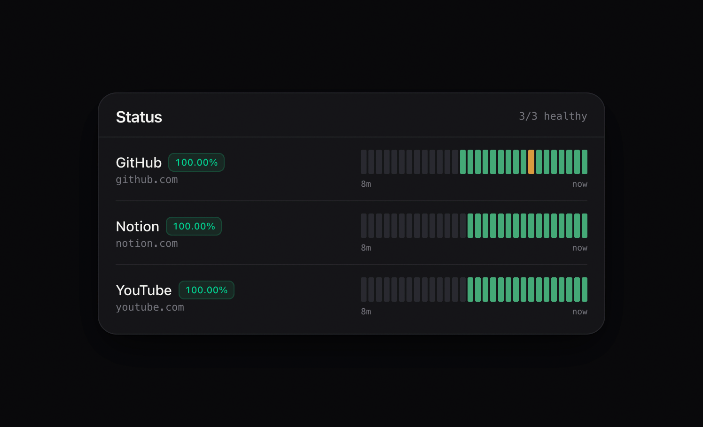

# Status Board

A minimal uptime page for HTTP(s).



## Getting Started

```bash
mkdir -p status-board/config && cd status-board
curl -o config/config.yaml \
  https://raw.githubusercontent.com/timblazing/status-board/main/config.example.yaml
```

Using docker compose:

```yaml
services:
  status-board:
    image: ghcr.io/timblazing/status-board:latest
    container_name: status-board
    ports:
      - 8080:8080
    volumes:
      - ./config:/config:ro
    restart: unless-stopped
```

or docker run:

```bash
docker run --name status-board \
  -p 8080:8080 \
  -v "$PWD/config:/config:ro" \
  --restart unless-stopped \
  ghcr.io/timblazing/status-board:latest
```

## Configuration

```yaml
services:
  - name: My Site
    url: https://example.com
```

| Key | Default | Meaning |
| --- | --- | --- |
| `title` | `Status` | Heading and browser tab title |
| `favicon` | built-in | URL of an image to use as the tab icon |
| `theme` | `system` | `dark`, `light` or `system` |
| `port` | `8080` | Port inside the container |
| `check_interval` | `60` | Seconds between checks of each service |
| `refresh_interval` | `30` | Seconds between browser refreshes |
| `history_size` | `30` | Number of bars kept per service |
| `degraded_threshold_ms` | unset | Optional. Slower than this while up = Degraded |
| `icons` | `true` | Show an icon to the left of each service name |
| `show.description` | `true` | Show the line under each service name |
| `show.bars` | `true` | Show the history bars |
| `show.time_labels` | `true` | Show the `15m … now` labels under the bars |

Per service: `name` and `url` are required. `description` sets the line under
the name and falls back to the URL when omitted. `timeout` (ms, default
`10000`), `expected_status` (default any 2xx/3xx), `degraded_threshold_ms`,
`icon` and `headers` are optional.

By default the tab icon is a green activity glyph. Point `favicon` at any image
URL to replace it:

```yaml
favicon: https://example.com/logo.png
```

Each service gets an icon to the left of its name: a brand logo from
[svgl](https://svgl.app) where the domain is recognised, otherwise that site's
own favicon, and no icon at all if neither loads. Lookups happen on the server,
once per domain, and are cached. Override one with any image URL, or turn the
whole column off:

```yaml
icons: true            # false hides every icon, `icon:` included

services:
  - name: Database
    url: https://db.example.com/healthz
    icon: https://db.example.com/icon.png
```

Each service name is followed by a badge with that service's uptime percentage,
tinted by state — green operational, amber degraded, red down. When a service
has no `description`, the URL is shown instead and links to the service in a new
tab. Under the history bars, the left label is how far back the retained checks
reach and the right is always `now`.

Services can optionally be grouped:

```yaml
groups:
  - name: Core
    services: [API, Web App]
```

See `config.example.yaml` for a fully commented file.
